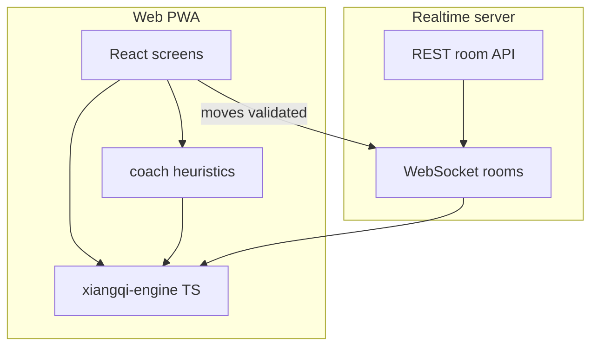
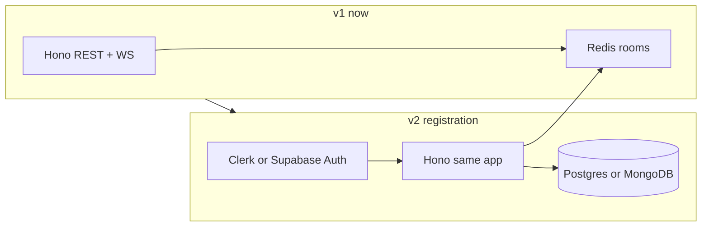

# Jade Court — Implementation Plan

## What the prototype already proves

[chinese-chess.html](chinese-chess.html) is a **~15MB single-file bundle** (Cursor/Canvas export) containing a complete **React SPA** titled **Jade Court · Learn & Play Xiangqi**. Decoded behavior maps cleanly to five routes:

| Route | Screen | Core behavior |
|-------|--------|----------------|
| `home` | Home | Mode cards + nav |
| `learn` | Learn with AI | Vs AI + **Master Lin** coach chat (move grading, hints, piece tips) |
| `play` | Play vs Computer | Same engine, lighter UI |
| `lessons` | Lessons / Puzzles | 8 static piece lessons + 3 tactical puzzles |
| `multiplayer` | Friends | Create room / join code / **pass-and-play** |

**Already implemented in the client (reuse, don't rewrite from scratch):**

- **Rules engine** (`window.XQ`): 10×9 board, all piece moves, palace/river, flying-general rule, check/checkmate/stalemate, `legalMoves`, `applyMove`.
- **AI** (`negamax` + alpha-beta, material + positional eval, depth by difficulty). Beginner intentionally plays weaker (random + shallow search).
- **Coach** (template-based, not LLM): `gradeMove` vs engine best move → verdicts (excellent / good / inaccuracy / mistake / blunder), `hint`, `describeMove`.
- **Content**: `LESSONS` (8 entries), `PUZZLES` (3), `LEVELS` (beginner/intermediate/advanced).
- **UI**: `XQBoard`, theme tokens (cream/jade/gold), piece styles (classic/brush), board backgrounds.

**Prototype gap (must build for v1):**

- **Multiplayer is fake**: `Lobby` auto-sets `joined` after 4.2s; no WebSocket, no move sync between devices.
- **Not maintainable**: one HTML file with embedded gzip assets — needs a normal repo layout, tests, and deploy pipeline.



---

## Recommended tech stack (web PWA, full parity)

### Frontend (primary)

| Layer | Choice | Why |
|-------|--------|-----|
| Framework | **React 19 + TypeScript** | Direct port from prototype; largest reuse |
| Build | **Vite** | Fast dev, PWA plugin, easy monorepo |
| Routing | **React Router v7** | Matches `home` / `learn` / `play` / `lessons` / `multiplayer` |
| Styling | **CSS modules or Tailwind v4** | Prototype already uses design tokens (`--cream`, `--jade`, `--font-piece`); port tokens first, utilities second |
| State | **Zustand** (game session) + local component state | Keeps board/history out of global churn |
| PWA | **vite-plugin-pwa** | Offline shell + "Add to Home Screen" on mobile |
| Tests | **Vitest** (engine) + **Playwright** (flows) | Engine correctness is non-negotiable for chess |

### Shared game logic (critical path)

| Layer | Choice | Why |
|-------|--------|-----|
| Engine package | **`packages/xiangqi-engine`** (TypeScript, zero React deps) | Port `window.XQ` + `AI` negamax/coach grading; import from web **and** server for authoritative validation |
| Tests | Golden tests for rules (flying general, cannon screen, horse leg, stalemate) | Prevents regressions when UI changes |
| Stronger AI (post-v1) | **WASM UCI engine** (e.g. Pikafish port for Xiangqi) behind same `chooseMove` interface | Prototype depth 2–4 is fine for learning; advanced tier can swap engine without UI rewrite |

**Do not** depend on a random npm xiangqi package without auditing rule completeness; your prototype engine is already complete and tested in UX — port it.

### Backend (real friends play)

| Layer | Choice | Why |
|-------|--------|-----|
| Runtime | **Node.js + Hono** (or **Fastify**) | Same language as engine package → shared types for `Move`, `RoomState` |
| Realtime | **WebSocket** (`ws` or **Socket.IO**) | Move events, presence, rematch |
| Room store | **Redis** (Upstash) | Ephemeral rooms, TTL, pub/sub if you scale to multiple server instances |
| Durable data | **MongoDB Atlas** (default; see database verdict) | Users, finished games with embedded `history[]`, lesson progress |
| REST | `POST /rooms`, `POST /rooms/:id/join` | Create room → return `JADE-XXXX` + join URL |
| Deploy | **Fly.io** or **Railway** (API+WS) + **Vercel/Cloudflare** (static web) | Simple, cheap for a learning project |

**Multiplayer protocol (minimal):**

1. Host creates room → server stores `{ fen or board, red/black seats, turn }`.
2. Guest joins with code → server assigns side.
3. Client sends `{ type: 'move', from, to }` → **server runs `legalMoves` + `applyMove`** → broadcasts new state.
4. Pass-and-play stays **100% client-side** (no server).

Optional later: **Supabase Realtime** instead of custom WS if you want auth + DB in one vendor — slightly less control over move validation order.

### Backend choice and future registration (Hono is enough)

**Short answer:** Hono is not a weak or "starter-only" choice. User registration is solved by **auth + database**, not by swapping to a "more powerful" web framework (NestJS, Django, Rails). Hono handles HTTP and middleware; it does not limit you from adding accounts later.

What registration actually needs (none of this requires abandoning Hono):

| Concern | What you add later | Works with Hono? |
|---------|-------------------|------------------|
| Sign up / login | Hosted auth (**Clerk**, **Auth0**) or **Supabase Auth** / **Lucia** | Yes — JWT/session verified in Hono middleware |
| User records | **PostgreSQL** (Drizzle/Prisma) **or MongoDB** (official driver / Mongoose) | Yes — Hono does not care which DB you use |
| Passwords / OAuth | Handled by auth provider (recommended) or Lucia | Yes |
| Friend list, game history | Your own collections (`users`, `games`, `friendships`) | Yes |
| Realtime games | Keep existing WebSocket server; attach `userId` to room seats | Yes |



**Recommended path for Jade Court (keeps plan simple, registration-ready):**

1. **v1:** Hono + WebSocket + Redis only; rooms keyed by anonymous `sessionId` (cookie or localStorage UUID).
2. **When adding registration:** Pick one auth strategy (see below); add `users` table; protect routes with `authMiddleware`; store `hostUserId` on rooms and `playerUserId` on game history rows.
3. **Do not rewrite** the game server into NestJS/Django unless you personally want that ecosystem — it adds boilerplate without making Xiangqi or WebSockets easier.

**Three auth strategies (pick one when you're ready):**

| Strategy | Pros | Cons | Fits Hono? |
|----------|------|------|------------|
| **A. Clerk / Auth0 (hosted)** | Fastest: email, Google, Apple UI out of the box; Hono verifies JWT | Monthly cost at scale; less control over user table shape | Best default for solo dev |
| **B. Supabase Auth + Postgres** | Auth + DB + optional Realtime in one product; good if you want SQL dashboards | Tighter coupling to Supabase; custom WS still recommended for move validation | Hono stays game API; Supabase handles users |
| **C. Self-hosted Lucia + Drizzle + Postgres** | Full ownership, no auth vendor lock-in | You build email flows, reset password, etc. | Hono + Lucia is a common pairing |
| **D. Clerk + MongoDB (Mongoose or native driver)** | Document model for games/progress; Hono stays thin | You manage indexes and schema discipline in app code | **Best fit if you want a document DB** |

**When you might choose something other than Hono:**

- **Supabase-only backend for v1:** Skip custom Node server initially; use Supabase for auth + Realtime rooms. Tradeoff: move validation must run in Edge Functions or client with trust implications — weaker fit for competitive play.
- **NestJS:** Only if you want large-team structure (modules, DI, guards everywhere). Overkill for this app size; same Postgres + JWT stack underneath.
- **Django/Rails:** Fine if you prefer Python/Ruby, but you lose sharing `packages/xiangqi-engine` with the server without a separate port or WASM.

**Design now so registration is a small add-on (no rework):**

- Issue a stable anonymous `deviceId` / `guestId` in v1; map to `userId` on first login (merge progress optional).
- Type room/game models with optional `userId?: string` from day one.
- Centralize auth in `apps/server/src/middleware/auth.ts` (stub returns `null` in v1; later verifies JWT).
- Use a **durable database** (PostgreSQL or MongoDB) for anything that must survive Redis TTL (finished games, ratings, lesson progress) — Redis stays ephemeral for live rooms only.

### MongoDB with Hono (yes — fully supported)

**Hono has no built-in database layer.** It only handles HTTP/WebSocket. You connect to MongoDB from your route handlers the same way you would in any Node app:

| Approach | Package | Notes |
|----------|---------|-------|
| Official driver | `mongodb` | Lightweight; use in `apps/server/src/db.ts` with a shared `MongoClient` |
| ODM | `mongoose` | Schemas, validation, middleware — familiar if you like document models |
| Prisma | `@prisma/client` | Supports MongoDB (with some relation limitations vs SQL) |

Typical pattern in Hono:

```ts
// apps/server/src/db.ts — connect once at startup
export const db = client.db('jade_court');

// apps/server/src/routes/games.ts
app.get('/games/:id', async (c) => {
  const game = await db.collection('games').findOne({ _id: id });
  return c.json(game);
});
```

Hosted options: **MongoDB Atlas** (free tier), Railway, Fly.io + Atlas. Auth (**Clerk**, etc.) still works the same — JWT middleware in Hono, store `clerkUserId` on your `users` document.

**Document DB vs relational for Jade Court**

| Data | Document (Mongo) fit | Relational (Postgres) fit |
|------|---------------------|---------------------------|
| User profile, settings, lesson progress | Natural nested doc | Fine as rows |
| Finished game + move list (`history[]`) | **Strong fit** — one `games` doc with embedded moves | Fine with `games` + `moves` table |
| Friend list / invites | Array of IDs or separate `friendships` collection | Easy with join table |
| Leaderboards / stats aggregations | Doable (`$group`) | Often simpler in SQL |
| Strict referential integrity | Weaker (app-enforced) | Strong FK constraints |

**Recommendation if you prefer MongoDB:**

- **v1:** Hono + Redis (live rooms) — unchanged.
- **v1.1+:** **MongoDB Atlas** for `users`, `games`, `puzzle_progress`; keep **Redis** for in-progress multiplayer only.
- **Auth:** **Clerk + MongoDB** is a common pair (Clerk owns identity; you upsert a `users` doc on first API call). Avoid Supabase Auth if you want Mongo-only — Supabase is Postgres-centric.
- **Repository layout:** `apps/server/src/db/` with collection helpers; shared Zod/TypeScript types for `GameDoc`, `UserDoc` (same types as API responses).

**Caveats (not blockers):**

- Prisma + Mongo lacks some relation features; Mongoose or the native driver are often simpler for Mongo-first projects.
- Live game state in Redis is still recommended — don't write every move to Mongo synchronously during play; **persist the finished game** (or periodic snapshot) on game end.
- Transactions: Mongo multi-doc transactions exist but are used less than in SQL; for Jade Court, embedding `history` in one game document avoids most cross-collection transaction needs.

**When Postgres might still be better:** heavy friend-graph queries, complex ratings leaderboards, or you want Supabase as an all-in-one backend. **When Mongo is a good call:** variable game payloads, nested lesson progress, flexible user metadata, and you're already comfortable with documents.

### Database decision: moves + registration (verdict)

**Registration does not favor either database.** Sign-up/login lives in **Clerk** (or similar); your DB only stores a profile mirror (`clerkId`, display name, preferences). That is one row or one document — equally simple in Postgres or Mongo.

**Move storage is where the choice matters.** For Jade Court, the dominant pattern is:

```ts
// One finished game — natural document shape
{
  _id, redUserId?, blackUserId?, mode: 'learn' | 'pvp' | 'ai',
  result, startedAt, endedAt,
  history: [{ from, to, piece, capture?, gaveCheck? }, ...]
}
```

| Criterion | Document DB (Mongo) | Relational (Postgres) |
|-----------|---------------------|------------------------|
| Store full game + all moves | **Best** — single write, single read for replay | Good — `games` + `moves` table or JSONB column |
| Replay / "my games" list | Index `redUserId` / `blackUserId`, return whole doc | Same with indexed FKs |
| Lesson/puzzle progress on user | **Best** — nested fields on `users` doc | JSONB column or extra tables |
| Live game (in progress) | **Redis** (both stacks) | **Redis** (both stacks) |
| Friend invites / social graph | OK with `friendships` collection | **Better** if graph queries grow |
| Leaderboards / ELO / SQL reports | Harder (`$group`, careful indexes) | **Better** |
| Schema changes (coach metadata, AI eval per move) | **Flexible** — add fields to move subdocs | JSONB or migrations |
| Data integrity (user must exist) | App-level checks | FK constraints |

**Recommendation for Jade Court:** **MongoDB is the better default** for your stated goals (moves + registration-ready), because:

1. **Moves are append-only game blobs**, not rows you join across thousands of tables.
2. **User progress is hierarchical** (lessons completed, puzzle stars, settings) — maps cleanly to one `users` document.
3. **Registration adds little complexity** either way; Clerk + Mongo upsert on first `GET /me` is straightforward.
4. You already lean document DB — fighting that preference buys little at learning-app scale.

**Choose Postgres instead if** you expect these soon (not just "maybe someday"):

- Global leaderboards and rating systems with heavy aggregation
- Supabase as auth + DB in one product
- Admin/analytics SQL you want to run ad hoc
- Strict multi-table transactions (e.g. tournament brackets with payouts)

**Hybrid (optional, usually overkill early):** Redis (live) + Mongo (games/users) covers 95% of needs. Do not add Postgres *and* Mongo unless you have a clear split (e.g. Mongo for games, Postgres for billing).

**Planned default stack (updated):** Hono + Redis + **MongoDB Atlas** + **Clerk** (when registration ships). Persist games on `game over`; optional snapshot every N moves for reconnect/disconnect recovery.

Example collections:

- `users` — `{ clerkId, displayName, createdAt, progress: { lessons, puzzles }, settings }`
- `games` — `{ players, history[], result, mode, timestamps }`
- `friendships` — `{ userId, friendId, status }` (or embed `friendIds[]` on user for MVP)

### Auth & accounts (phased)

- **v1:** Anonymous sessions + room codes (matches prototype UX); Hono + Redis as planned.
- **v1.1 / registration:** Add **Clerk** (recommended) + **MongoDB Atlas** *or* Clerk/Supabase + **PostgreSQL**; same Hono app gains protected routes (`GET /me`, `GET /games`, friend invites). WebSocket handshake sends JWT once, server binds socket to `userId`.
- **Not required for prototype parity** — defer until after multiplayer works.

### Coach / "Learn with AI"

- **v1**: Keep **deterministic coach** from prototype (`feedbackFor`, `hint`, `Coach.pieceTip`) — works offline, no API cost, predictable pedagogy.
- **v2 (optional)**: LLM layer (**OpenAI / Anthropic**) only for rephrasing `feedbackFor` output, not for legality — never let the LLM invent moves.

---

## Target repository layout

```
jade-court/
  apps/
    web/                 # Vite React PWA
    server/              # Hono + WebSocket + Redis
  packages/
    xiangqi-engine/      # Rules + AI + coach grading (ported from prototype)
  chinese-chess.html     # Archive/reference until port complete
```

---

## Implementation phases

### Phase 1 — Foundation (week 1)

1. Scaffold **pnpm monorepo** with `apps/web` and `packages/xiangqi-engine`.
2. **Port `window.XQ` and AI/coach modules** to TypeScript with Vitest fixtures extracted from prototype positions (puzzles + lesson boards).
3. Set up Vite + React Router; global CSS variables copied from prototype `<style>` block.
4. Add `vite-plugin-pwa` (name: Jade Court, theme color from `--jade`).
5. In `apps/server`, add stub `authMiddleware` (guest-only) and optional `userId` fields on room types so registration is a plug-in later, not a rewrite.

**Exit criteria:** Engine tests pass; empty shell app runs.

### Phase 2 — UI port (weeks 2–3)

Port components in dependency order (reuse JSX structure from bundled template):

1. `XQBoard`, `useXiangqiGame`, `CapturedTray`, `GameOverCard`
2. `HomeScreen`, `Topbar`, `ModeCard`
3. `PlayScreen` + `Setup` (difficulty + side)
4. `LessonsScreen` / `LessonBoard` / `PuzzleView` + static `LESSONS` / `PUZZLES` data as JSON
5. `LearnScreen` + coach chat (`CoachAvatar`, `ChatBubble`, message list)
6. `ThemeTweaks` (board/piece/accent) → `localStorage`

**Exit criteria:** All non-multiplayer flows match prototype; no dependency on `chinese-chess.html` at runtime.

### Phase 3 — Real multiplayer (week 4)

1. `apps/server`: room CRUD + WebSocket handler.
2. Replace prototype `Lobby` simulation with:
   - **Create room** → show link `?room=JADE-XXXX` + copy button
   - **Join room** → validate code, assign Black, sync board
3. `useRoomGame` hook: optimistic UI, server ack, rollback on illegal move.
4. Reconnect handling: on refresh, rejoin room from URL query param.

**Exit criteria:** Two browsers/devices play a full game; pass-and-play still works offline.

### Phase 4 — Polish & ship (week 5)

- Playwright: home → play game → lesson → puzzle → create/join room
- Accessibility: keyboard focus, `aria-label` on squares, reduced motion
- Performance: code-split routes (`learn`, `multiplayer` lazy)
- Analytics (optional): Plausible/PostHog for mode usage
- Deploy web + server; document env vars (`REDIS_URL`, `VITE_WS_URL`)

---

## Key design decisions

### Authoritative server for online play

Client runs engine for UX (highlights, hints); **server re-validates every move** using the same `packages/xiangqi-engine`. Prevents cheating and desync.

### Single source of truth for game state

```ts
type GameState = {
  board: Board;
  turn: 'r' | 'b';
  history: Move[];
  status: null | 'checkmate' | 'stalemate';
};
```

Serialize to JSON over WS; optional FEN later for persistence/replay.

### Content as data

Move `LESSONS`, `PUZZLES`, `LEVELS` to `apps/web/src/content/*.ts` (or JSON) so you can add puzzles without touching board code.

### Preserve prototype pedagogy

Coach thresholds (`lossCp` for blunder/mistake) and copy ("Master Lin") should migrate verbatim first; tune after user testing.

---

## Risks and mitigations

| Risk | Mitigation |
|------|------------|
| Porting bugs in obscure rules (flying general, repeated position) | Engine test suite from puzzle/lesson positions + known Xiangqi rule cases |
| WebSocket complexity | Start with in-memory rooms; add Redis when you need multi-instance |
| Weak advanced AI | Swappable `chooseMove` provider; ship prototype negamax in v1 |
| Large bundle from fonts | Subset Noto Serif SC / self-host woff2; lazy-load lesson routes |

---

## What to extract from the prototype (concrete first PR)

1. Decode template once into `reference/` (gitignored or committed once) — script already proven via Python `__bundler/manifest` parse.
2. Copy `const X = ...` / `useXiangqiGame` / `XQBoard` into `packages/xiangqi-engine` and `apps/web` respectively.
3. Copy CSS variables and component class names (`card`, `btn-gold`, `pill-jade`) to preserve visual identity.

---

## Suggested alternatives (if you want to simplify later)

- **Skip custom server**: PartyKit or Liveblocks for rooms — faster MVP, less validation control (still run engine client-side + server function).
- **Auth-first monolith**: Supabase for users + Postgres from day one, Hono only for WebSocket game server — good if registration is weeks away, not months.
- **Mongo-first persistence**: Clerk + MongoDB Atlas + Hono; Redis only for live rooms — aligns with document DB preference (see plan section).
- **Stronger AI sooner**: Embed WASM xiangqi engine; keep coach on top for explanations only.
- **LLM coach**: Add only after deterministic coach ships; use structured prompts with engine JSON (best move, eval delta).

---

## Success criteria for v1 launch

- PWA installable on mobile
- **Learn with AI**, **Play vs Computer**, **Lessons**, **Puzzles**, **Pass-and-play**, and **real online friend rooms** all work
- Engine covered by automated tests
- Prototype visual identity preserved (Jade Court branding, board themes)
